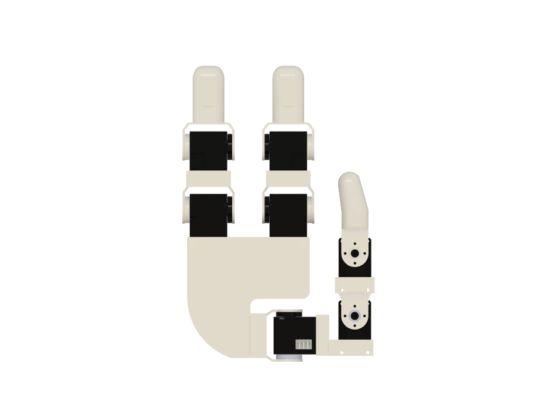
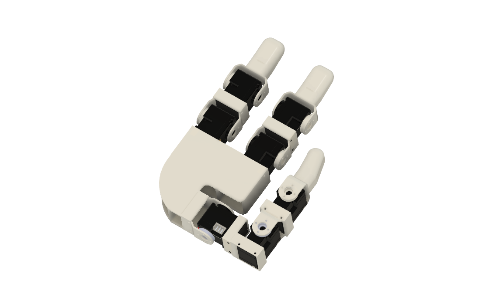
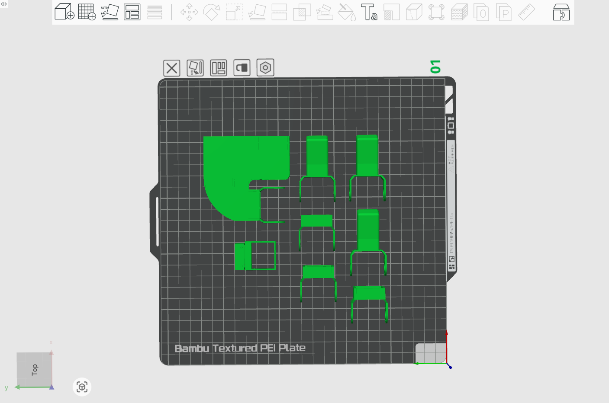

# Pathon Dexterous Hand V1

A 3-finger, servo-actuated dexterous hand designed for fast prototyping and manipulation research. Built around the **DYNAMIXEL XL330-M288-T**. This is **V1** of the Pathon Dexterous Hand.

| Front view | Isometric view |
|---|---|
|  |  |

## Demo

https://www.loom.com/share/230f5db9a7ae4e8f90ad7e18fb1e4fa1

*Pathon Dexterous Hand V1 demo.*

## Design Goals

- **Fast to prototype** — servo-actuated instead of tendon-driven; fewer accessories, easier assembly.
- **Research-grade actuators** — Dynamixel XL330-M288-T gives full position / velocity / current feedback and a mature SDK.
- **Reasonable dexterity** — 3 fingers (2 fingers + opposable thumb) cover a wide range of grasps while keeping mechanical complexity manageable for a first build.

## Specs

| Spec | Value |
|---|---|
| **Fingers** | 3 (2 fingers + thumb) |
| **Motors** | 7 × [DYNAMIXEL XL330-M288-T](https://www.robotis.us/dynamixel-xl330-m288-t/) |
| **Stall torque** | 0.52 Nm (5.3 kg-cm) per servo |
| **Resolution** | 4096 steps (12-bit) |
| **Protocol** | TTL half-duplex (also SBUS / iBUS / PWM supported) |
| **Voltage** | 5 V |
| **Feedback** | Position, velocity, current, voltage, temperature |
| **Host control** | Raspberry Pi 5 via U2D2 (or equivalent TTL adapter) |

## Software

Use [Dynamixel Wizard](https://emanual.robotis.com/docs/en/software/dynamixel/dynamixel_wizard2/) for first-time servo ID assignment and the [Dynamixel SDK](https://github.com/ROBOTIS-GIT/DynamixelSDK) (Python / C++ / ROS) for runtime control.

## Hardware Files

```
dexterous_hand/
├── cad/
│   └── pathon_dex_hand.step      # full assembly (STEP) — source for URDF
├── stl/
│   ├── palm.stl                  # palm body
│   ├── Body17.stl                # main body / chassis
│   ├── 11.stl, 12.stl            # finger 1 segments
│   ├── 21.stl, 22.stl            # finger 2 segments
│   └── th_1.stl, th_2.stl, th_3.stl   # thumb segments
├── 3mf/
│   └── Dex_hand.3mf              # Bambu Studio print project (all parts pre-arranged)
└── media/
    ├── hand_front.png
    ├── hand_iso.png
    └── print_layout.png
```

## Printing

All parts fit on a single Bambu A1 / P1S build plate. Use the bundled `3mf/Dex_hand.3mf` to load the pre-arranged plate directly in Bambu Studio.



Suggested print settings (starting point — tune for your printer):

| Setting | Value |
|---|---|
| Material | PLA or PETG |
| Layer height | 0.2 mm |
| Walls | 4 |
| Infill | 25–40% (gyroid) |
| Supports | Tree, only where needed (palm cavity, thumb base) |

> If you want extra wear life on the joints, print finger segments in PETG and the palm in PLA.

