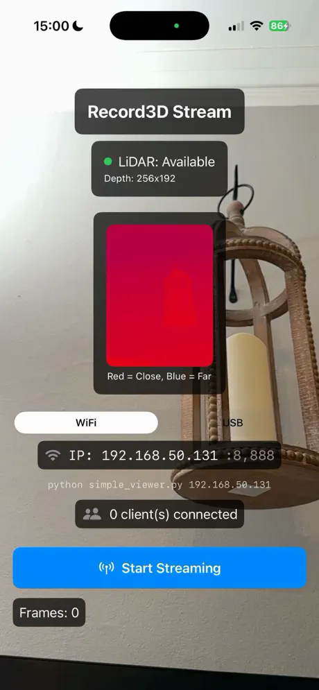
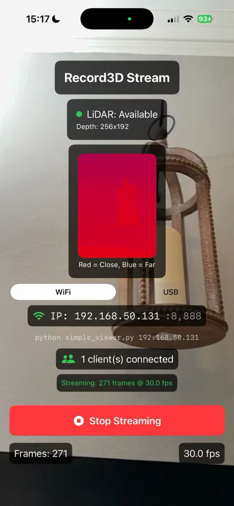

# Record3DStream

[](https://discord.gg/xukJ3nh9wC)
[](https://github.com/PathOn-AI?tab=followers)
[](https://github.com/PathOn-AI/pathon_opensource/stargazers)

Use an iPhone as a full sensor suite (LiDAR RGBD, IMU, confidence) for low-cost robot manipulation and autonomous navigation. Stream to Python or ROS2 over WiFi or USB.

📖 [Blog: iPhone as a Robot Sensor Suite](https://www.pathon.ai/blog/iphone-as-sensor) *(work in progress)*

<p align="center">
  
</p>

## iOS App

Download the free iOS streaming app:

[](https://apps.apple.com/app/id6761314229)

<p align="center">
  
  
</p>

<p align="center"><em>Left: app ready to stream. Right: streaming at 30fps with 1 client connected.</em></p>

## Demo

Using the iPhone's LiDAR as a drop-in replacement for a 2D laser scanner. The `/scan` topic produced by `pointcloud_to_laserscan` (started by the ROS2 driver's launch file) feeds a standard 2D SLAM pipeline.

https://www.loom.com/share/903ef7a126844111a8025947679171dd

*Mapping stage: iPhone-as-2D-LiDAR feeding 2D SLAM.*

## Overview

The iPhone LiDAR (dToF flash sensor) + RGB camera + IMU replaces multiple traditional robot sensors:

| iPhone Sensor | Replaces | Output |
|---|---|---|
| LiDAR + RGB + ML | Depth camera (RealSense) | PointCloud2, depth image |
| LiDAR (middle row) | 2D LiDAR (RPLIDAR, Hokuyo) | LaserScan |
| RGB camera | USB camera | Color image |
| IMU (accelerometer + gyroscope) | External IMU | IMU data |

## Architecture

```
iPhone (iOS App)                          PC / Robot (ROS2)
┌────────────────────┐                   ┌──────────────────────────┐
│ ARKit captures:    │   WiFi / USB      │ Python SDK               │
│  - RGB image       │ ──────────────→   │  - Decode stream         │
│  - LiDAR depth     │   TCP stream      │                          │
│  - IMU data        │                   │ ROS2 Driver              │
│  - Camera params   │                   │  - PointCloud2           │
│  - Camera pose     │                   │  - LaserScan             │
│  - Confidence map  │                   │  - RGB + Depth images    │
└────────────────────┘                   │  - CameraInfo            │
                                         │  - IMU                   │
                                         │  - TF tree               │
                                         │                          │
                                         │ Calibration              │
                                         │  - ArUco marker pose     │
                                         │  - base → camera_link TF │
                                         └──────────────────────────┘
```

## Project Structure

```
├── sdk/                    # Python client library
├── ros2-driver/            # ROS2 Jazzy package
└── calibration/            # ArUco-based camera-to-robot calibration
```

Each component has its own README with install, build, and run instructions:

- **[sdk/README.md](sdk/README.md)** — Python client (no ROS2 required), API reference, examples
- **[ros2-driver/README.md](ros2-driver/README.md)** — ROS2 Jazzy package, published topics, parameters, TF frames
- **[calibration/README.md](calibration/README.md)** — ArUco-based camera-to-robot calibration

## Prerequisites

- **iPhone**: iPhone 12 Pro or newer (with LiDAR) running the iOS streaming app
- **Host machine**: Ubuntu with ROS2 Jazzy (for ROS2 usage) or any OS with Python 3.10+ (for Python-only usage)
- **Network**: iPhone and host machine on the same WiFi network (for WiFi mode)
- **USB mode** (optional): `sudo apt install libimobiledevice-utils libusbmuxd-tools` (Linux) or `brew install libimobiledevice` (macOS)

## Getting Started

1. Install and launch the iOS streaming app on your iPhone Pro — the app screen shows the **server IP address** you'll need.
2. Pick the component you want to use and follow its README:
   - Python-only client → [sdk/README.md](sdk/README.md)
   - ROS2 driver → [ros2-driver/README.md](ros2-driver/README.md)
   - Camera-to-robot calibration → [calibration/README.md](calibration/README.md)

## 📰 News

| Date | Release |
|------|---------|
| 2026-04-17 | New version of calibration (coming soon) |
| 2026-04-07 | iOS app released on the [App Store](https://apps.apple.com/app/id6761314229) |
| 2026-03-09 | iPhone Sensor Suite open-sourced: Python SDK, ROS2 driver, and ArUco calibration |

## How iPhone LiDAR Works

The iPhone LiDAR is a 3D dToF (direct Time-of-Flight) flash sensor. ARKit processes the raw data through three internal pipelines:

| Pipeline | Input | Output | Persistence | We Use It |
|---|---|---|---|---|
| **Depth** | LiDAR + RGB + ML | `sceneDepth` (256x192 depth image) | Per-frame | Yes |
| **Scene Mesh** | Many LiDAR frames accumulated | `ARMeshAnchor` (triangle mesh + classification) | Persistent | Not yet |
| **Body Tracking** | RGB + Neural Engine ML | `ARBodyAnchor` (91 skeleton joints) | Per-frame | Not yet |

Currently we only use Pipeline 1 (depth). The depth image is unprojected to a point cloud (all pixels) and sliced into a LaserScan (middle row).

