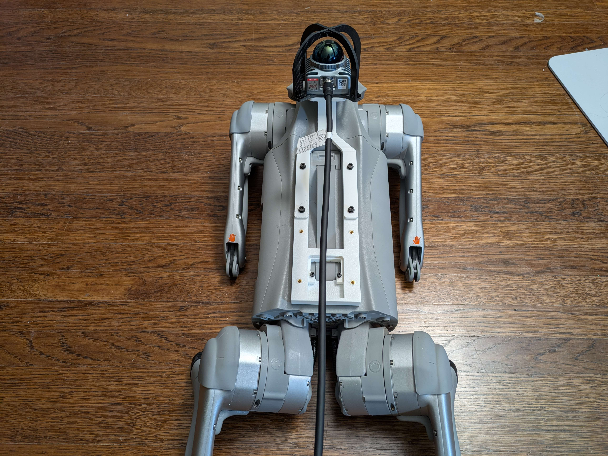
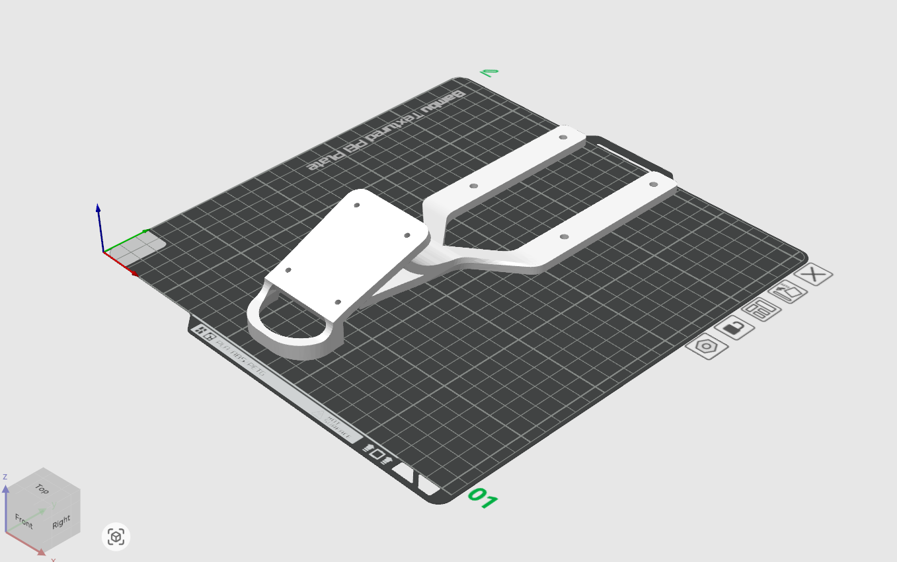
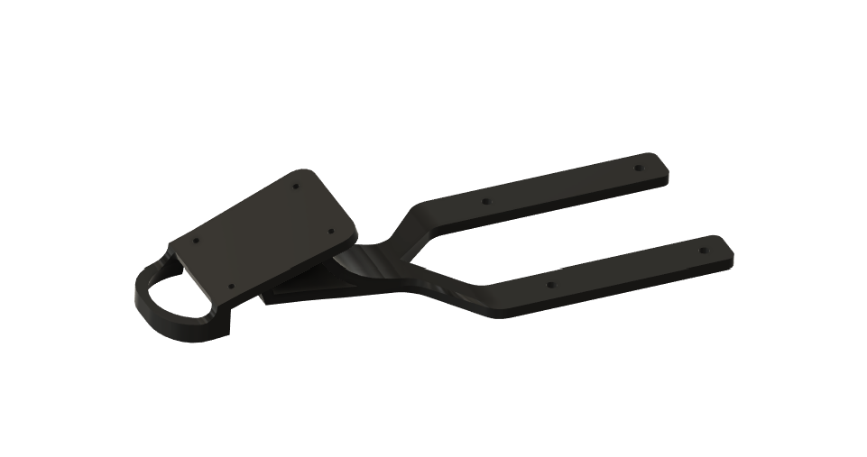
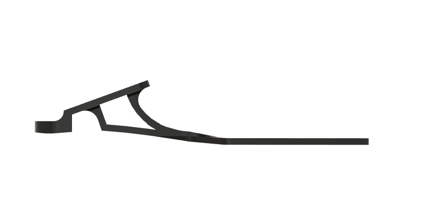
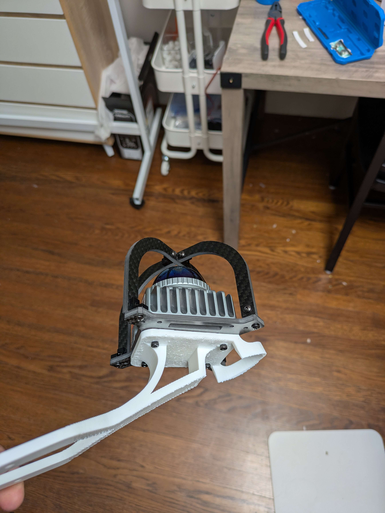
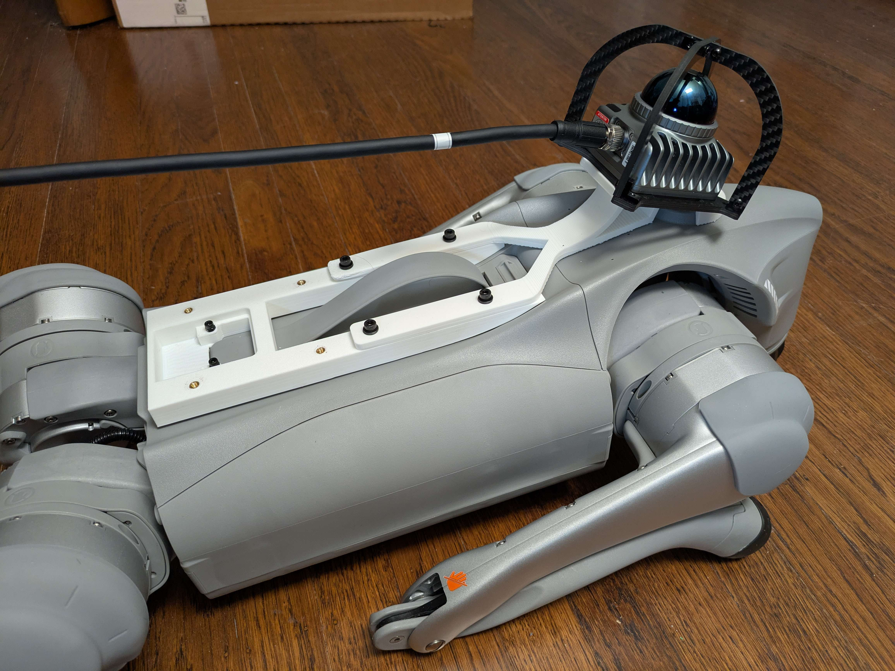
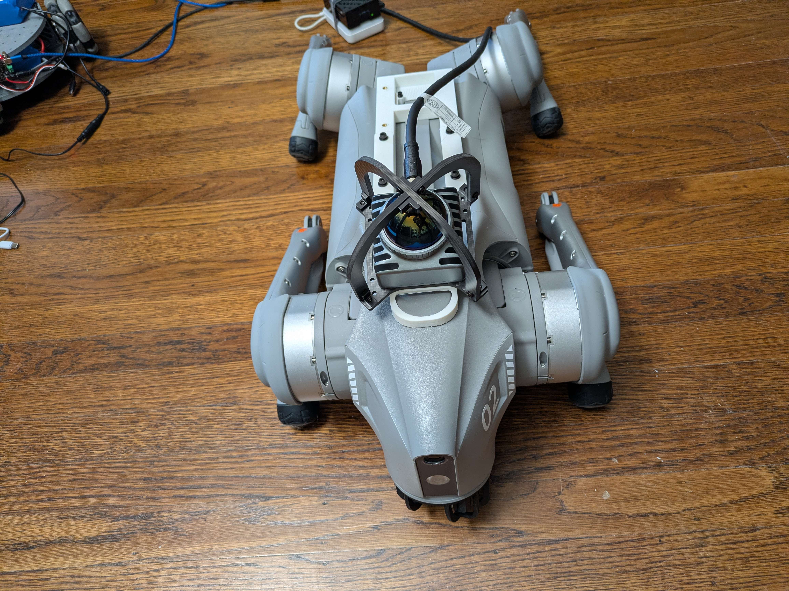
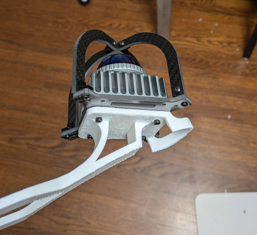

# Livox Mid-360 Mount for Unitree Go2

A 3D-printable cantilever bracket that mounts a [Livox Mid-360](https://www.livoxtech.com/mid-360) LiDAR forward of the Unitree Go2's head. The bracket bolts onto a T-track base plate on the Go2's back deck, holding the sensor clear of the body so it has an unobstructed 360° horizontal field of view.

## Files

| File | Description |
|---|---|
| [`cad/livox_mid360_mount.stl`](cad/livox_mid360_mount.stl) | Printable mesh of the mount |

## Required companion part — base plate

This bracket attaches to a separately printed T-track base plate that fastens to the Go2's back. Print the base plate from:

> **Base Unitree Go2 (T-Track 30)** — https://www.printables.com/model/1221220-base-unitree-go-2-t-track-30/files

The two arms on the rear of this bracket slide into the T-track on that base.

## Print settings

| Setting | Value |
|---|---|
| Material | PETG (recommended) or PLA+ |
| Layer height | 0.20 mm |
| Walls / perimeters | 4 |
| Infill | 30–40 % gyroid |
| Supports | Tree supports under the cantilever / sensor plate |
| Orientation | Print flat on the bed — see slicer view below |

PETG is preferred over PLA because the sensor (~265 g) is held at the end of a long cantilever; PLA can creep under sustained load, especially in warm conditions.

## Hardware

- **Sensor-to-bracket:** 4× M3 screws into the Mid-360's mounting pattern (length depends on plate thickness — ~M3×8 typical)
- **Bracket-to-base:** M3 screws + nuts captured in the T-track on the base plate
- **Optional:** Sorbothane / rubber washers between sensor and plate to damp motor and footstep vibration that would otherwise reach the Mid-360's internal IMU

## Assembly

1. Print the base T-track plate (link above) and bolt it to the Go2's back deck.
2. Print this bracket.
3. Mount the Livox Mid-360 to the front sensor plate of the bracket (4× M3).
4. Slide the rear arms of the bracket into the T-track on the base plate and tighten.
5. Route the Mid-360 cable along the cantilever back to the Go2's onboard compute. Leave slack so the cable doesn't tug when the dog crouches.

## Renders

| | |
|---|---|
|  |  |

## Photos

| | |
|---|---|
|  |  |
|  |  |

## Notes

- The Mid-360's downward FOV is roughly −7° to −52°; this cantilever pushes the sensor forward of the Go2 to keep the dog's body out of the lower cone.
- A carbon-fiber roll cage (visible in the photos) is recommended to protect the sensor dome from falls.
- Verify the sensor's +X axis points forward and the dome is level when the Go2 is standing — most LIO/SLAM stacks assume this.
